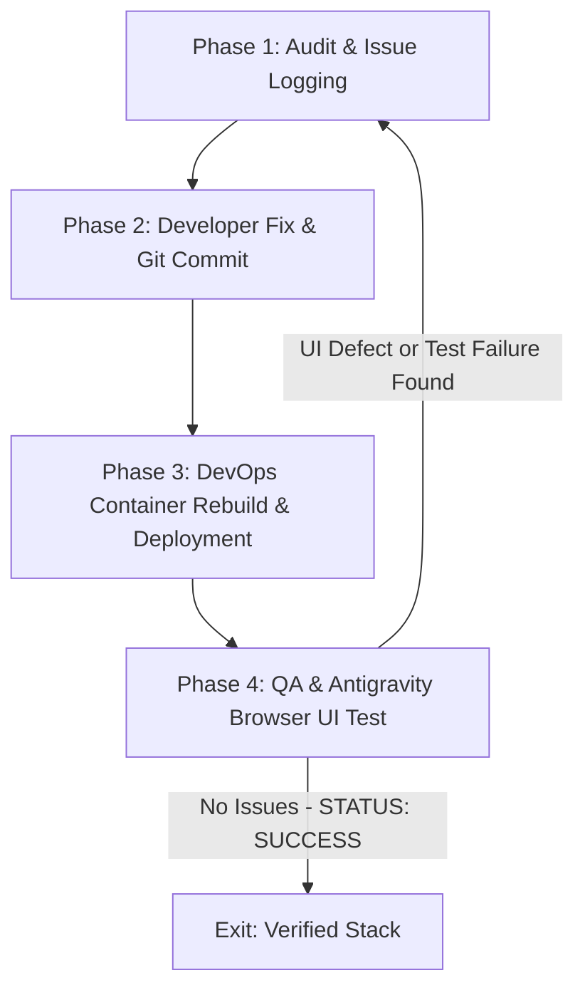

# Dev-DevOps-QA Self-Healing Loop Skill

## Overview
This skill automates the full development, container deployment, testing, and UI verification cycle using a continuous self-healing orchestration loop.

## Workflow Pipeline

### Phase 1: Audit & Issue Logging
- QA Agent (`qa_engineer`) runs baseline tests (`pytest backend/tests -v`, `npm run lint`) and documents state in `.agents/logs/qa_test_results.log`.
- Whenever new UI defects or API failures are discovered in Phase 4/3, QA appends the detailed issues (screenshots, DOM notes, stack traces) directly into `.agents/logs/qa_test_results.log` (Phase 1) for the Developer Agent.

### Phase 2: Developer Fix & Code Update
- Developer Agent (`developer`) reads `.agents/logs/qa_test_results.log` to extract new issues appended from Phase 1/Phase 4.
- Developer analyzes the issue, updates source code, React components, CSS styling, or Docker configurations, explains proposed changes briefly, and creates a local git commit (`git add`, `git commit`).

### Phase 3: DevOps Container Rebuild & Deployment (MANDATORY ON ANY CODE/CONFIG CHANGE)
- Control MUST pass to DevOps Agent (`devops`).
- Only build required or changed image
- Whenever source code, Dockerfiles (`Dockerfile.*`), or `docker-compose.yml` are modified, DevOps Agent MUST execute the container stack rebuild and background deployment:
  `docker compose down && docker compose up --build -d`
- DevOps Agent verifies container health (`docker compose ps`) and checks container ports and logs (`docker compose logs backend`, `docker compose logs nginx`).
- Record build and container execution status in `.agents/logs/devops_build.log`.
- If containers fail to build or boot, DevOps routes Docker logs back to Phase 1 for Developer remediation.

### Phase 4: QA & Antigravity Browser Subagent UI Verification
- Once DevOps Agent confirms containers are up and healthy:
  - QA Agent runs backend integration tests against the live container endpoints.
  - QA Agent launches the **Antigravity Browser Agent** (`browser_subagent`) to test the live containerized UI in the browser (`http://localhost:5173` or `http://localhost:8080`).
  - Inspects authentication, chat streaming, document upload, responsive layout, and dark/light theme toggle.
  - **If any new issue is found**: QA appends the exact issue details to `.agents/logs/qa_test_results.log` (Phase 1) and loops back to Developer (Phase 2).
  - **Exit Condition**: If zero issues are found and UI is fully verified, QA appends `STATUS: SUCCESS - ALL TESTS PASSED` to exit the loop cleanly.

## Critical Safety
- **Max 10 Loop Iterations Limit**: If the loop bounces back and forth more than 10 times without resolving all issues, halt execution, generate a git diff summary of changes made, and request human intervention.
