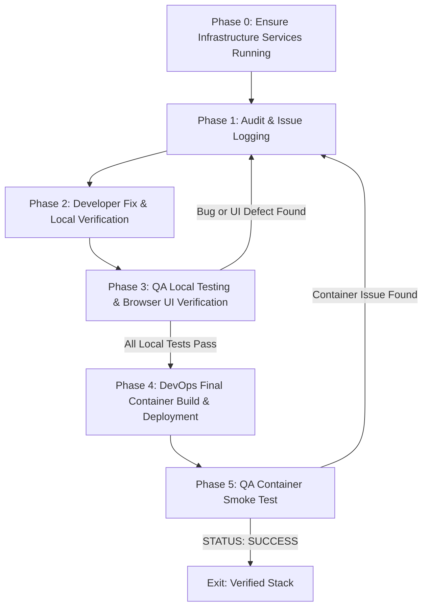

# Dev-DevOps-QA Self-Healing Loop Skill

## Overview
This skill automates the full development, testing, and deployment cycle using a continuous self-healing orchestration loop. **Development and QA testing happen against local dev servers for fast iteration.** Docker container builds only happen at the very end once everything is verified locally.

## Architecture: Local Dev + Docker Infrastructure

During the dev/test loop (Phases 1-3), the stack runs as:
- **Backend**: `fastapi dev` (local, http://localhost:8000)
- **Frontend**: `npm run dev` (local, http://localhost:5173)
- **Infrastructure** (Docker): MongoDB, Valkey/Redis, Qdrant — via `docker compose up -d mongodb valkey qdrant`

This avoids slow Docker image rebuilds on every code change.

## Workflow Pipeline

### Phase 0: Infrastructure Services (One-time Setup)
- Ensure Docker infrastructure services are running:
  `docker compose up -d mongodb valkey qdrant`
- Do NOT start backend/frontend containers — those run locally during development.
- Verify services are reachable (MongoDB on 27017, Valkey on 6379, Qdrant on 6333).

### Phase 1: Audit & Issue Logging
- QA Agent (`qa_engineer`) runs baseline tests and documents state in `.agents/logs/qa_test_results.log`.
- Whenever new UI defects or API failures are discovered in Phase 3/5, QA appends the detailed issues (screenshots, DOM notes, stack traces) directly into `.agents/logs/qa_test_results.log` for the Developer Agent.

### Phase 2: Developer Fix & Local Verification
- Developer Agent (`developer`) reads `.agents/logs/qa_test_results.log` to extract issues.
- Developer analyzes the issue, updates source code, React components, CSS styling, or configurations.
- Developer explains proposed changes briefly, then applies them.
- **Start local dev servers** (if not already running):
  - Backend: `cd backend && fastapi dev app/main.py --host 0.0.0.0 --port 8000`
  - Frontend: `cd frontend && npm run dev`
- Quick-verify the fix works locally (e.g., curl the endpoint, check browser).
- Creates a local git commit (`git add`, `git commit`) upon fix completion.
- **DO NOT rebuild Docker images during this phase.** Local dev servers pick up changes instantly.

### Phase 3: QA Local Testing & Browser UI Verification
- QA Agent (`qa_engineer`) tests against **local dev servers**:
  - Backend API: `http://localhost:8000`
  - Frontend UI: `http://localhost:5173`
- Runs backend tests: `pytest backend/tests -v`
- Runs frontend lint: `npm run lint` (from frontend dir)
- Launches **Antigravity Browser Agent** (`browser_subagent`) to test the live local UI at `http://localhost:5173`.
- Inspects authentication, chat streaming, document upload, workspace creation, responsive layout, and dark/light theme toggle.
- **If any issue is found**: QA appends details to `.agents/logs/qa_test_results.log` and loops back to Phase 2 (Developer).
- **If all tests pass locally**: Proceed to Phase 4 (DevOps final build).

### Phase 4: DevOps Final Container Build & Deployment
- **Only triggered after all local tests pass in Phase 3.**
- DevOps Agent (`devops`) rebuilds the full containerized stack:
  `docker compose down && docker compose up --build -d`
- Verifies container health (`docker compose ps`) and checks container logs.
- Records build status in `.agents/logs/devops_build.log`.
- If containers fail to build or boot, routes Docker logs back to Phase 1 for Developer remediation.

### Phase 5: QA Container Smoke Test
- Once DevOps confirms containers are up and healthy:
  - QA Agent launches Browser Agent to quickly smoke-test the containerized UI at `http://localhost:5173`.
  - Verifies login, workspace creation, and basic chat flow work in the containerized environment.
  - **If any container-specific issue is found**: Append to `.agents/logs/qa_test_results.log` and loop back to Phase 1.
  - **Exit Condition**: If smoke tests pass, QA appends `STATUS: SUCCESS - ALL TESTS PASSED` and exits the loop.

## Critical Safety
- **Max 10 Loop Iterations Limit**: If the loop bounces back and forth more than 10 times without resolving all issues, halt execution, generate a git diff summary of changes made, and request human intervention.
- **Never rebuild Docker images during Phase 2/3 iteration cycles.** Only Phase 4 triggers container builds.
