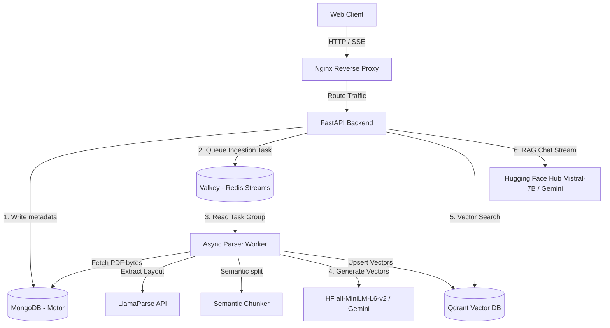

# KnowledgeOS - Multi-Tenant RAG Ingestion Pipeline & Chat API

KnowledgeOS is a production-grade, event-driven, multi-tenant RAG (Retrieval-Augmented Generation) SaaS platform. It enables organizations to securely ingest complex documents (PDFs) and perform isolated semantic search queries.

This architecture is optimized for **CPU-only host environments** (no GPU required) by delegating CPU-bound parsing and vector embedding operations to cloud-hosted API services (**LlamaParse** and **Google Gemini**).

---

## 🏗️ System Architecture

The platform is designed as a decoupled microservices architecture connected via asynchronous messaging and internal Docker networks:



---

## 🛠️ Technology Stack

- **Web Core**: Python 3.13, FastAPI, Uvicorn, Pydantic v2
- **Asynchronous Driver**: AsyncIO, Motor (MongoDB driver), redis-py-async
- **Task Queue**: Valkey / Redis Streams (with Consumer Groups, acknowledgements, and Dead-Letter Queue retries)
- **Document Parser**: LlamaParse API (cloud-based layout-aware parsing) with local **PyMuPDF** and **Tesseract OCR** fallbacks
- **Vector Database**: Qdrant (payload filtering, keyword index, hybrid search)
- **LLM & Embeddings**: Dynamic model providers (defaults to **Hugging Face Hub Inference APIs** for free execution: `sentence-transformers/all-MiniLM-L6-v2` for embeddings and `mistralai/Mistral-7B-Instruct-v0.3` for LLM chat; supports **Google Gemini API** as an alternative)
- **Observability**: Structlog (JSON structured logs), Prometheus, Grafana, OpenTelemetry
- **Infrastructure**: Docker, Docker Compose, Nginx (reverse proxy with SSE optimizations)

---

## 📂 Repository Structure

```
KnowledgeOS/
├── backend/                   # FastAPI Web Application
│   ├── app/
│   │   ├── api/v1/            # API endpoints (Auth, Workspaces, Documents, Chat)
│   │   ├── core/              # Database connection, Config, Security
│   │   ├── models/            # Pydantic schemas and database mappings
│   │   └── main.py            # FastAPI entrypoint, middlewares, lifespan
│   └── requirements.txt       # Web application dependencies
│
├── workers/                   # Event-Driven Ingestion Workers
│   ├── app/
│   │   ├── config.py          # Worker settings
│   │   ├── parser.py          # PDF parsing (LlamaParse + PyMuPDF/OCR fallback)
│   │   ├── chunker.py         # Semantic similarity-based chunker
│   │   ├── embedder.py        # Gemini embedding client
│   │   ├── indexer.py         # Qdrant indexing
│   │   └── main.py            # Stream listener & task runner
│   └── requirements.txt       # Worker service dependencies
│
├── infra/                     # Infrastructure Configuration
│   ├── nginx/
│   │   └── nginx.conf         # SSE routing and reverse proxy
│   └── prometheus/
│       └── prometheus.yml     # Scraping metric inputs
│
├── docs/                      # Extensive Deep-Dive Architectural Docs (00 - 24)
├── docker-compose.yml         # Container orchestration
├── Dockerfile.backend         # Multi-stage FastAPI image
├── Dockerfile.worker          # Lightweight Tesseract parser image
└── README.md                  # Project overview & startup instructions
```

---

## 🚀 Getting Started & Execution Guide

### 1. Prerequisites
- **Docker & Docker Compose** (Recommended for full containerized stack).
- **Python 3.13+** & **Node.js 20+** (For local development).
- **Hugging Face API Token** (Default free LLM provider) OR **Google Gemini API Key**.
- **LlamaParse API Key** (Optional, falls back to PyMuPDF/Tesseract OCR).

---

### 2. Environment Setup
Create a `.env` file in the project root:
```bash
cp .env.example .env
```

Ensure mandatory configuration variables are set in `.env`:
```env
# Auth & Security
JWT_SECRET=your_super_secret_jwt_key_at_least_32_chars
JWT_REFRESH_SECRET=your_super_secret_refresh_jwt_key

# Databases & Queues
MONGODB_URL=mongodb://localhost:27017
MONGODB_DB_NAME=knowledge_os
REDIS_URL=redis://localhost:6379
QDRANT_URL=http://localhost:6333

# LLM & Embeddings Provider ('huggingface' or 'gemini')
LLM_PROVIDER=huggingface
HUGGINGFACE_API_KEY=your_huggingface_token
GEMINI_API_KEY=your_gemini_api_key
```

---

### 3. Option A: Running with Docker Compose (Production / Full Stack)

1. **Build and start all container services in background:**
   ```bash
   docker compose up --build -d
   ```

2. **Verify container health:**
   ```bash
   docker compose ps
   ```

3. **View logs:**
   ```bash
   docker compose logs -f backend worker
   ```

4. **Service Gateways:**
   - **Frontend UI / API Proxy**: `http://localhost`
   - **FastAPI OpenAPI Specs**: `http://localhost/docs` or `http://localhost:8000/docs`
   - **Prometheus Monitoring**: `http://localhost:9090`
   - **Grafana Dashboard**: `http://localhost:3000` (User: `admin`, Pass: `admin`)

---

### 4. Option B: Running Locally for Development

#### A. Start Infrastructure Databases (MongoDB, Valkey, Qdrant)
```bash
docker compose up -d mongodb valkey qdrant
```

#### B. Start Backend API
```bash
cd backend
python -m venv .venv
# On Windows PowerShell:
.\.venv\Scripts\activate
# On Linux/macOS:
# source .venv/bin/activate

pip install -r requirements.txt
uvicorn app.main:app --reload --host 0.0.0.0 --port 8000
```

#### C. Start Worker Process
In a separate terminal:
```bash
cd workers
python -m venv .venv
# On Windows PowerShell:
.\.venv\Scripts\activate
# On Linux/macOS:
# source .venv/bin/activate

pip install -r requirements.txt
# Optional: Install Graphify CLI for Knowledge Graph extraction
pip install graphifyy && graphify install

python app/main.py
```

#### D. Start Frontend UI
In a separate terminal:
```bash
cd frontend
npm ci
npm run dev
```
Access UI at `http://localhost:5173`.

---

### 5. 🧪 Running the Test Suite

#### A. Backend Unit Tests (Fast, Mocked DBs)
```bash
# From workspace root using backend virtual environment:
backend/.venv/Scripts/python.exe -m pytest backend/test_backend.py -v
```

#### B. Live E2E Integration Suite (Tests real API, Auth & Multi-Tenancy)
Ensure backend is running at `http://localhost:8000`:
```bash
python backend/test_e2e_live.py --base-url http://localhost:8000
```

---

### 6. 🕸️ Graphify Knowledge Graph Setup (Additional Feature)

KnowledgeOS automatically generates a compact GraphRAG summary using `graphify`.
- **Install Graphify in Worker Environment:**
  ```bash
  pip install graphifyy
  graphify install
  ```
- **Codebase Knowledge Graph (Dev Tool):**
  To visualize the codebase graph report:
  ```bash
  graphify update .
  ```
  Reports are generated in `graphify-out/GRAPH_REPORT.md` and `graphify-out/graph.html`.

For a complete breakdown of all 7 additional features implemented beyond the initial requirements, see [`docs/99_Additional_Features.md`](file:///f:/Ridhin/KnowledgeOS/docs/99_Additional_Features.md).

---

## 🔒 Multi-Tenant Isolation Flow
1. **User Scope**: Users belong to a workspace. Their requests are signed using JWT tokens.
2. **Document Scope**: Documents are uploaded and mapped to a specific `workspace_id`.
3. **Queue Scope**: Ingestion worker processes the task, embedding and indexing sections.
4. **Vector Scope**: Every chunk indexed in Qdrant has a metadata payload `{"workspace_id": "WS_UUID"}`.
5. **Search Scope**: Qdrant queries include a mandatory payload filter:
   ```json
   {
       "must": [
           { "key": "workspace_id", "match": { "value": "WS_UUID" } }
       ]
   }
   ```
   This ensures that no user can retrieve search results or interact with documents belonging to other workspaces.

