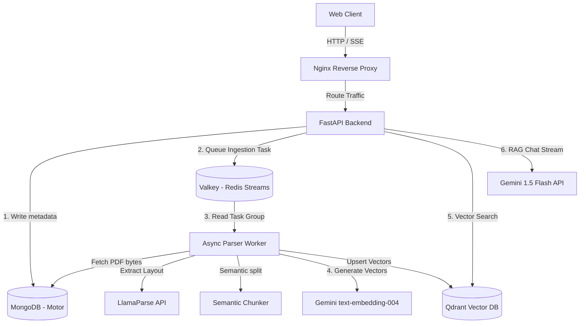

# KnowledgeOS - Multi-Tenant RAG Ingestion Pipeline & Chat API

KnowledgeOS is a production-grade, event-driven, multi-tenant RAG (Retrieval-Augmented Generation) SaaS platform. It enables organizations to securely ingest complex documents (PDFs) and perform isolated semantic search queries.

This architecture is optimized for **CPU-only host environments** (no GPU required) by delegating CPU-bound parsing and vector embedding operations to cloud-hosted API services (**LlamaParse** and **Google Gemini**).

---

## 🏗️ System Architecture

The platform is designed as a decoupled microservices architecture connected via asynchronous messaging and internal Docker networks:



---

## 🛠️ Technology Stack

- **Web Core**: Python 3.13, FastAPI, Uvicorn, Pydantic v2
- **Asynchronous Driver**: AsyncIO, Motor (MongoDB driver), redis-py-async
- **Task Queue**: Valkey / Redis Streams (with Consumer Groups, acknowledgements, and Dead-Letter Queue retries)
- **Document Parser**: LlamaParse API (cloud-based layout-aware parsing) with local **PyMuPDF** and **Tesseract OCR** fallbacks
- **Vector Database**: Qdrant (payload filtering, keyword index, hybrid search)
- **LLM & Embeddings**: Google Gemini API (`gemini-1.5-flash` for chat; `text-embedding-004` for 768-dimensional embeddings)
- **Observability**: Structlog (JSON structured logs), Prometheus, Grafana, OpenTelemetry
- **Infrastructure**: Docker, Docker Compose, Nginx (reverse proxy with SSE optimizations)

---

## 📂 Repository Structure

```
KnowledgeOS/
├── backend/                   # FastAPI Web Application
│   ├── app/
│   │   ├── api/v1/            # API endpoints (Auth, Workspaces, Documents, Chat)
│   │   ├── core/              # Database connection, Config, Security
│   │   ├── models/            # Pydantic schemas and database mappings
│   │   └── main.py            # FastAPI entrypoint, middlewares, lifespan
│   └── requirements.txt       # Web application dependencies
│
├── workers/                   # Event-Driven Ingestion Workers
│   ├── app/
│   │   ├── config.py          # Worker settings
│   │   ├── parser.py          # PDF parsing (LlamaParse + PyMuPDF/OCR fallback)
│   │   ├── chunker.py         # Semantic similarity-based chunker
│   │   ├── embedder.py        # Gemini embedding client
│   │   ├── indexer.py         # Qdrant indexing
│   │   └── main.py            # Stream listener & task runner
│   └── requirements.txt       # Worker service dependencies
│
├── infra/                     # Infrastructure Configuration
│   ├── nginx/
│   │   └── nginx.conf         # SSE routing and reverse proxy
│   └── prometheus/
│       └── prometheus.yml     # Scraping metric inputs
│
├── docs/                      # Extensive Deep-Dive Architectural Docs (00 - 24)
├── docker-compose.yml         # Container orchestration
├── Dockerfile.backend         # Multi-stage FastAPI image
├── Dockerfile.worker          # Lightweight Tesseract parser image
└── README.md                  # Project overview & startup instructions
```

---

## 🚀 Getting Started

### 1. Prerequisites
- Docker & Docker Compose installed.
- A **Google Gemini API Key** (from Google AI Studio).
- A **LlamaParse API Key** (optional, falls back to local PyMuPDF if unconfigured).

### 2. Configure Environment Variables
Create a `.env` file in the root directory (based on `.env.example`):
```bash
cp .env.example .env
```
Fill in the API keys:
```env
GEMINI_API_KEY=your_google_gemini_key_here
LLAMAPARSE_API_KEY=your_llamaparse_key_here
```

### 3. Spin Up Services
Run the following command to build and launch all containers in the background:
```bash
docker compose up --build -d
```

Verify that all services are running:
```bash
docker compose ps
```

### 4. Service Gateways
- **API Gateway (Nginx)**: `http://localhost`
- **FastAPI OpenAPI Documentation**: `http://localhost/docs`
- **Prometheus Dashboard**: `http://localhost:9090` (restricted to localhost)
- **MongoDB (Internal)**: `mongodb://localhost:27017` (restricted to localhost)
- **Qdrant (Internal)**: `http://localhost:6333` (restricted to localhost)

---

## 🔒 Multi-Tenant Isolation Flow
1. **User Scope**: Users belong to a workspace. Their requests are signed using JWT tokens.
2. **Document Scope**: Documents are uploaded and mapped to a specific `workspace_id`.
3. **Queue Scope**: Ingestion worker processes the task, embedding and indexing sections.
4. **Vector Scope**: Every chunk indexed in Qdrant has a metadata payload `{"workspace_id": "WS_UUID"}`.
5. **Search Scope**: Qdrant queries include a mandatory payload filter:
   ```json
   {
       "must": [
           { "key": "workspace_id", "match": { "value": "WS_UUID" } }
       ]
   }
   ```
   This ensures that no user can retrieve search results or interact with documents belonging to other workspaces.
