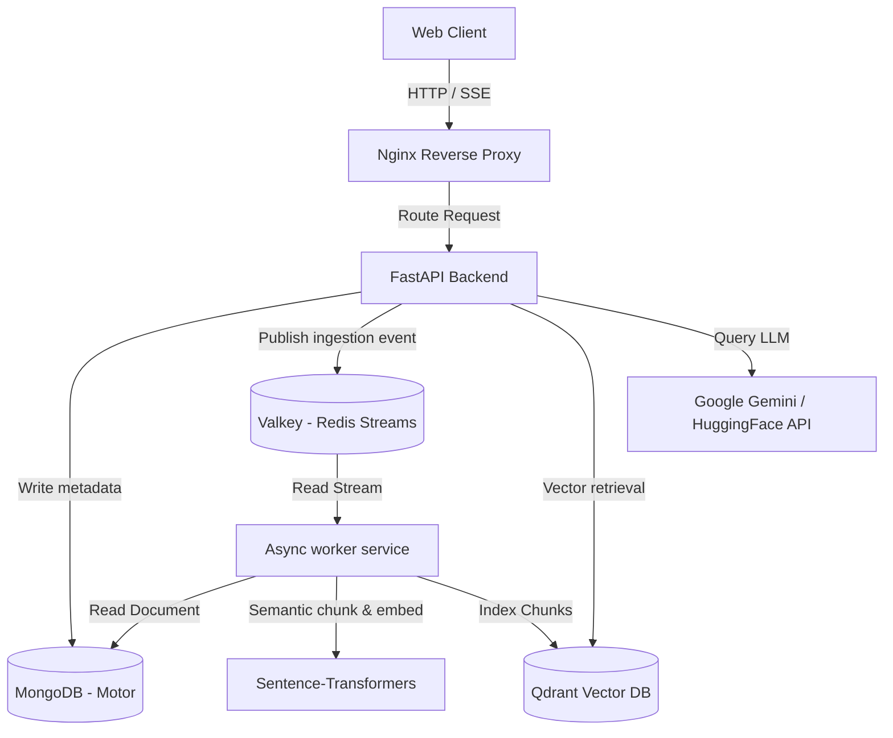

# High-Level Architecture - KnowledgeOS

## Why This Design Exists
A scalable RAG system requires dividing concerns between the stateless web tier and stateful background processing. The high-level architecture maps the interaction boundaries between clients, the API gateway, the ingestion queue, processing workers, databases, and LLM services.

---

## Alternative Approaches
- **Choreographed Microservices**: Each service communicates via an enterprise service bus (ESB) like Kafka.
  - *Trade-off*: Highly decoupled but extremely complex to deploy, configure, and maintain.
- **Orchestrated Shared Database (Selected)**: The backend API and worker service share a database (MongoDB) and messaging stream (Redis/Valkey).
  - *Trade-off*: Low operational complexity, rapid query resolution, and highly scalable.

---

## Trade-offs
- **Shared Mongo vs. Distributed Databases**: A shared database allows workers and APIs to reference identical schemas instantly without sync delays. The downside is that scaling requires scaling MongoDB itself (sharding), but for this SaaS profile, it is well within transactional capabilities.
- **No Shared Disk**: Workers pull files directly from MongoDB GridFS or object storage (or local uploads volume mapped on docker) to remain stateless.

---

## Production Considerations
- **Load Balancing**: Use Nginx to distribute HTTP and SSE connections across multiple scaled FastAPI container instances.
- **Microservices Network**: Keep all database, queue, and application ports blocked to external networks, exposing only the Nginx port.

---

## Implementation Notes
- API endpoints handle auth verification and route commands.
- The task publishing step inserts a document ingestion ticket into Valkey. The queue event contains the `document_id`.

---

## Common Mistakes
- **Direct Database Exposure**: Allowing workers to directly expose data back to client terminals.
- **Tight Coupling**: Direct HTTP calls from the backend to workers. If a worker goes offline, the backend shouldn't crash.

---

## Interview Questions
1. **Q: Draw or explain the complete flow of a document from upload to searchability.**
   *A: 1. User uploads a PDF to FastAPI. 2. FastAPI stores the file (or reference) in MongoDB and marks it `PENDING`. 3. FastAPI pushes a task to the Redis stream. 4. An idle worker reads the task, downloads the PDF, processes it with PyMuPDF/Docling, generates semantic chunks, embeds them, writes vectors to Qdrant, updates the MongoDB document status to `PROCESSED`. 5. The user can now chat with it.*
2. **Q: Why are Qdrant and MongoDB split? Can't we use MongoDB for vectors?**
   *A: MongoDB does support vector search, but dedicated vector databases like Qdrant provide specialized HNSW indexing, multi-tenancy payloads, hybrid search combining keyword and vector, and performance optimization for rapid retrieval at scale.*
